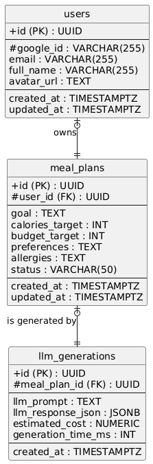

### Документация по схеме базы данных

#### ER-диаграмма

**Описание связей:**

1.  **`users` и `meal_plans` (Один ко многим):** Один пользователь (`users`) может иметь множество планов питания (`meal_plans`). Связь осуществляется через `meal_plans.user_id`, который ссылается на `users.id`. `ON DELETE CASCADE` означает, что при удалении пользователя все его планы питания также будут удалены.
2.  **`meal_plans` и `llm_generations` (Один к одному/многим):** Каждый план питания (`meal_plans`) связан с как минимум одной генерацией от LLM (`llm_generations`). При замене блюда или регенерации могут создаваться новые записи в `llm_generations`, связанные с тем же `meal_plan_id`. Это позволяет хранить историю изменений.

#### Индексы для производительности

- `idx_users_google_id`: Ускоряет поиск пользователя по его `google_id` при аутентификации.
- `idx_meal_plans_user_id`: Ускоряет выборку всех планов питания для конкретного пользователя (ключевая операция в разделе "Мои планы").
- `idx_llm_generations_meal_plan_id`: Ускоряет получение сгенерированного меню для выбранного плана.

#### Схема для LLM данных

Данные от LLM хранятся в таблице `llm_generations`:

- **`llm_prompt` (TEXT):** Сохраняется полный текст промпта, который был отправлен модели. Это критически важно для отладки, анализа и будущей доработки логики генерации.
- **`llm_response_json` (JSONB):** Ответ от модели хранится в бинарном формате JSONB. Этот тип данных высокопроизводителен, позволяет индексировать поля внутри JSON и выполнять сложные запросы к данным без необходимости парсинга на уровне приложения.
