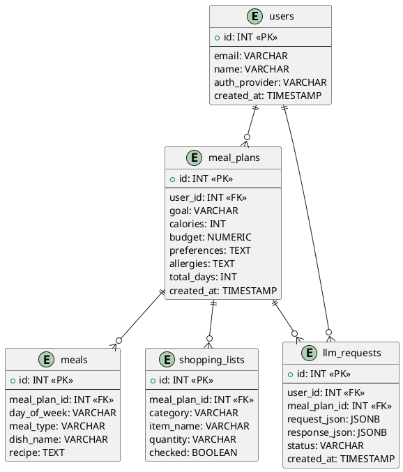

# 1. Проектирование схемы БД

## Основные сущности

| Таблица            | Назначение                                                       |
| ------------------ | ---------------------------------------------------------------- |
| **users**          | Данные пользователей (OAuth и профиль).                          |
| **meal_plans**     | Основная сущность плана питания (цель, калории, бюджет и т. д.). |
| **meals**          | Отдельные блюда в плане питания (день, тип, КБЖУ, рецепт).       |
| **shopping_lists** | Автоматически сгенерированные списки покупок.                    |
| **llm_requests**   | Логи обращений к LLM (входные данные, ответ, статус).            |

---

## 1.1 SQL схема (`database/schema.sql`)

```sql
-- 1. Таблица пользователей
CREATE TABLE users (
    id SERIAL PRIMARY KEY,
    email VARCHAR(255) UNIQUE NOT NULL,
    name VARCHAR(255),
    auth_provider VARCHAR(50) DEFAULT 'google',
    created_at TIMESTAMP DEFAULT CURRENT_TIMESTAMP
);

-- 2. Планы питания
CREATE TABLE meal_plans (
    id SERIAL PRIMARY KEY,
    user_id INT NOT NULL REFERENCES users(id) ON DELETE CASCADE,
    goal VARCHAR(255) NOT NULL,
    calories INT CHECK (calories BETWEEN 1000 AND 6000),
    budget NUMERIC(10,2) CHECK (budget >= 0),
    preferences TEXT,
    allergies TEXT,
    total_days INT DEFAULT 7,
    created_at TIMESTAMP DEFAULT CURRENT_TIMESTAMP
);

-- 3. Блюда в плане
CREATE TABLE meals (
    id SERIAL PRIMARY KEY,
    meal_plan_id INT NOT NULL REFERENCES meal_plans(id) ON DELETE CASCADE,
    day_of_week VARCHAR(20) NOT NULL,
    meal_type VARCHAR(50) NOT NULL, -- Завтрак, Обед, Ужин, Перекус
    dish_name VARCHAR(255) NOT NULL,
    calories INT,
    protein INT,
    fat INT,
    carbs INT,
    recipe TEXT
);

-- 4. Список покупок
CREATE TABLE shopping_lists (
    id SERIAL PRIMARY KEY,
    meal_plan_id INT NOT NULL REFERENCES meal_plans(id) ON DELETE CASCADE,
    category VARCHAR(100),
    item_name VARCHAR(255),
    quantity VARCHAR(50),
    checked BOOLEAN DEFAULT FALSE
);

-- 5. История взаимодействия с LLM
CREATE TABLE llm_requests (
    id SERIAL PRIMARY KEY,
    user_id INT REFERENCES users(id) ON DELETE CASCADE,
    meal_plan_id INT REFERENCES meal_plans(id) ON DELETE CASCADE,
    request_json JSONB,
    response_json JSONB,
    status VARCHAR(50) DEFAULT 'success',
    created_at TIMESTAMP DEFAULT CURRENT_TIMESTAMP
);

-- 🔍 Индексы
CREATE INDEX idx_mealplan_user ON meal_plans(user_id);
CREATE INDEX idx_meals_plan ON meals(meal_plan_id);
CREATE INDEX idx_llm_user ON llm_requests(user_id);
CREATE INDEX idx_shopping_plan ON shopping_lists(meal_plan_id);
```

---

## 1.2 ER-диаграмма




Описание связей:

1. users и meals_plan
   > Один user может иметь ноль или много планов (meal_plans). Один план (meal_plan) принадлежит одному и только одному user.
2. meal_plans и meals
   > Один meal_plan содержит ноль или много блюд (meals). Одно конкретное блюдо (meal) относится к одному и только одному плану питания.
3. meal_plans и shopping_lists
   > Один meal_plan генерирует ноль или много элементов списка покупок (shopping_lists). Каждый элемент списка покупок относится к одному и только одному плану питания.
4. users и llm_requests
   > Один user совершает ноль или много запросов к языковой модели (llm_requests). Каждый запрос к LLM инициируется одним и только одним пользователем.
5. meal_plans и llm_requests
   > Один meal_plan связан с нулем или множеством llm_requests. Каждый llm_request может быть связан с одним и только одним планом питания.

---

## 1.3 Индексы и производительность

- Индекс по `meal_plans.user_id` ускоряет выборку планов пользователя.
- Индекс по `meals.meal_plan_id` ускоряет загрузку плана по дням.
- Индекс по `shopping_lists.meal_plan_id` ускоряет получение списка покупок.
- Индекс по `llm_requests.user_id` — для аналитики и трекинга обращений.

---

## 1.4 Схема для LLM данных

LLM-запросы хранятся в таблице `llm_requests`.
Пример записи:

```json
{
  "id": 42,
  "user_id": 5,
  "meal_plan_id": 12,
  "request_json": {
    "goal": "похудение",
    "calories": 1800,
    "budget": 1500,
    "preferences": "вегетарианская диета",
    "allergies": "орехи"
  },
  "response_json": {
    "weekly_plan": [ { "day_of_week": "Monday", "meals": [...] } ]
  },
  "status": "success",
  "created_at": "2025-10-27T10:45:00Z"
}
```
