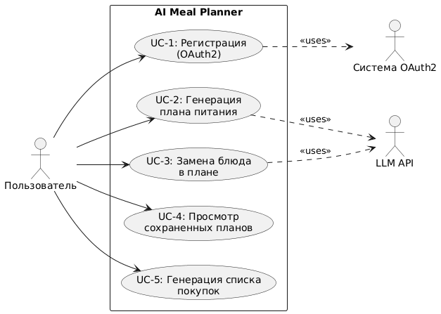

# D2: Use-case Narrative - AI Meal Planner

## Введение

Данный документ содержит детальное описание пользовательских сценариев (use-cases) для проекта AI Meal Planner. Каждый use-case описывает отдельную функцию системы с основным успешным сценарием, альтернативными путями и обработкой ошибок.

---

## Список Use-Cases

1. Регистрация пользователя (OAuth2)
2. Генерация персонального плана питания
3. Замена блюда в плане
4. Просмотр сохраненных планов питания
5. Генерация и экспорт списка покупок

---

## Use-Case Diagram

---

## UC-1: Регистрация пользователя (OAuth2)

### Описание

Пользователь регистрируется в системе через сторонний OAuth2 провайдер (Google, GitHub и т.д.)

### Actors

- **Primary:** Пользователь (незарегистрированный)
- **Secondary:** Система OAuth2 (Google/GitHub)

### Preconditions

- Пользователь не авторизован в системе
- OAuth2 провайдер доступен

### Postconditions

- Пользователь успешно зарегистрирован и авторизован
- Создан профиль пользователя в базе данных

---

### Сценарии

| **Тип сценария**       | **Название**                            | **Описание**                                                                                                                                                                                                                                                                                                                          | **User Value**                                                                      |
| ---------------------- | --------------------------------------- | ------------------------------------------------------------------------------------------------------------------------------------------------------------------------------------------------------------------------------------------------------------------------------------------------------------------------------------- | ----------------------------------------------------------------------------------- |
| **Happy Path**         | Успешная регистрация через Google       | 1. Пользователь нажимает "Войти через Google" 2. Система перенаправляет на страницу авторизации Google 3. Пользователь вводит учетные данные Google 4. Google подтверждает авторизацию и возвращает токен 5. Система создает профиль пользователя 6. Пользователь перенаправлен на главную страницу с активной сессией | **Быстрая регистрация:** Не нужно заполнять длинные формы, регистрация за 30 секунд |
| **Alternative Flow 1** | Пользователь уже зарегистрирован        | 1-4. (как в Happy Path) 5. Система обнаруживает существующий аккаунт по email 6. Система авторизует пользователя в существующем аккаунте 7. Показывается уведомление: "С возвращением!"                                                                                                                                      | **Удобство:** Не нужно помнить, регистрировался ли ранее                            |
| **Alternative Flow 2** | Отмена авторизации пользователем        | 1-2. (как в Happy Path) 3. Пользователь нажимает "Отмена" на странице OAuth провайдера 4. Система возвращает на страницу входа 5. Показывается сообщение: "Авторизация отменена"                                                                                                                                             | **Контроль:** Пользователь может передумать без последствий                         |
| **Error Scenario 1**   | OAuth провайдер недоступен              | 1. Пользователь нажимает "Войти через Google" 2. Система не может подключиться к OAuth API 3. Показывается ошибка: "Сервис временно недоступен. Попробуйте позже или выберите другой способ входа" 4. Логируется ошибка на бэкенде                                                                                           | **Прозрачность:** Пользователь понимает причину проблемы                            |
| **Error Scenario 2**   | Неверный токен от OAuth провайдера      | 1-4. (как в Happy Path) 5. Токен от Google невалиден или истек 6. Система показывает: "Ошибка авторизации. Попробуйте снова" 7. Пользователь возвращается на страницу входа                                                                                                                                                  | **Безопасность:** Защита от некорректных данных                                     |
| **Error Scenario 3**   | Email уже привязан к другому провайдеру | 1-4. (как в Happy Path) 5. Email уже зарегистрирован через GitHub 6. Показывается: "Этот email уже используется. Войдите через GitHub или используйте другой email"                                                                                                                                                             | **Предотвращение конфликтов:** Ясное объяснение проблемы и путей решения            |

---

## UC-2: Генерация персонального плана питания

### Описание

Авторизованный пользователь создает персонализированный недельный план питания на основе своих целей, бюджета и предпочтений.

### Actors

- **Primary:** Пользователь (авторизованный)
- **Secondary:** LLM API

### Preconditions

- Пользователь авторизован в системе
- LLM API доступен

### Postconditions

- Создан персонализированный план питания на неделю
- План сохранен в профиле пользователя

---

### Сценарии

| **Тип сценария**       | **Название**                            | **Описание**                                                                                                                                                                                                                                                                                                                                                                                                                                                                       | **User Value**                                                                                                                                   |
| ---------------------- | --------------------------------------- | ---------------------------------------------------------------------------------------------------------------------------------------------------------------------------------------------------------------------------------------------------------------------------------------------------------------------------------------------------------------------------------------------------------------------------------------------------------------------------------- | ------------------------------------------------------------------------------------------------------------------------------------------------ |
| **Happy Path**         | Успешная генерация плана                | 1. Пользователь нажимает "Создать новый план" 2. Заполняет форму: Цель (похудение), Бюджет (5000₽), Калории (1800), Предпочтения (курица, рыба), Аллергии (арахис) 3. Нажимает "Сгенерировать" 4. Система показывает индикатор загрузки 5. Бэкенд формирует промпт и отправляет в LLM 6. LLM возвращает план на 7 дней с меню и рецептами 7. Система отображает: меню на неделю, КБЖУ, рецепты, примерную стоимость 8. Пользователь нажимает "Сохранить план" | **Экономия времени:** План за 2-3 минуты вместо нескольких часов ручного планирования **Персонализация:** Точное соответствие целям и бюджету |
| **Alternative Flow 1** | Использование быстрых пресетов          | 1. Пользователь нажимает "Создать новый план" 2. Выбирает готовый пресет "Похудение на 1800 ккал" 3. Система автоматически заполняет параметры 4. Пользователь может скорректировать детали 5-8. (как в Happy Path)                                                                                                                                                                                                                                                    | **Удобство:** Еще быстрее начать для типовых целей                                                                                               |
| **Alternative Flow 2** | Неполный ввод данных                    | 1-2. Пользователь заполняет только обязательные поля (Цель и Калории) 3-6. (как в Happy Path) 7. Система генерирует базовый план с дефолтными значениями 8. Показывает подсказку: "Укажите бюджет и предпочтения для более точного плана" 9. Пользователь может "Уточнить параметры" или "Сохранить план"                                                                                                                                                              | **Низкий порог входа:** Можно получить результат с минимальными данными                                                                          |
| **Error Scenario 1**   | LLM API недоступен                      | 1-4. (как в Happy Path) 5. Запрос к LLM возвращает ошибку (таймаут/503) 6. Система показывает: "Не удалось сгенерировать план. Попробуйте через минуту" 7. Данные формы сохраняются 8. Кнопка "Повторить попытку" становится активной 9. Ошибка логируется                                                                                                                                                                                                          | **Надежность:** Данные не теряются, можно повторить                                                                                              |
| **Error Scenario 2**   | Некорректные данные в форме             | 1. Пользователь нажимает "Создать новый план" 2. Вводит текст в поле "Калории" или отрицательный бюджет 3. Поле подсвечивается красным 4. Показывается подсказка: "Введите число от 1000 до 5000" 5. Кнопка "Сгенерировать" неактивна                                                                                                                                                                                                                                  | **Предотвращение ошибок:** Мгновенная обратная связь до отправки запроса                                                                         |
| **Error Scenario 3**   | Превышение лимита генераций (Free план) | 1-2. (как в Happy Path) 3. Пользователь исчерпал дневной лимит (3 плана) 4. Система показывает модальное окно: "Дневной лимит исчерпан (3/3). Перейдите на Pro для неограниченных планов" 5. Кнопки: "Обновить тариф" / "Понятно"                                                                                                                                                                                                                                         | **Монетизация:** Ясная мотивация для апгрейда                                                                                                    |

---

## UC-3: Замена блюда в сгенерированном плане

### Описание

Пользователь заменяет отдельное блюдо в уже сгенерированном плане питания на альтернативный вариант.

### Actors

- **Primary:** Пользователь (авторизованный)
- **Secondary:** LLM API

### Preconditions

- Пользователь авторизован
- Существует сохраненный план питания
- План открыт для просмотра

### Postconditions

- Блюдо заменено на альтернативное
- План обновлен и пересохранен
- Пересчитаны КБЖУ и стоимость

---

### Сценарии

| **Тип сценария**       | **Название**                          | **Описание**                                                                                                                                                                                                                                                                                                                                                                                                                                                                                                         | **User Value**                                                                                            |
| ---------------------- | ------------------------------------- | -------------------------------------------------------------------------------------------------------------------------------------------------------------------------------------------------------------------------------------------------------------------------------------------------------------------------------------------------------------------------------------------------------------------------------------------------------------------------------------------------------------------- | --------------------------------------------------------------------------------------------------------- |
| **Happy Path**         | Замена блюда с указанием причины      | 1. Пользователь открывает сохраненный план 2. Нажимает на блюдо "Тушеная капуста" (обед, среда) 3. Нажимает кнопку "Заменить блюдо" 4. Вводит причину: "Не люблю капусту" 5. Нажимает "Подобрать альтернативу" 6. Система отправляет запрос в LLM с контекстом (КБЖУ, бюджет, ограничения) 7. LLM предлагает 3 варианта замены 8. Пользователь выбирает "Овощное рагу" 9. План автоматически обновляется, пересчитывается стоимость и КБЖУ 10. Показывается уведомление: "Блюдо заменено" | **Гибкость:** Быстрая адаптация плана без полной регенерации **Экономия времени:** Замена за 30 секунд |
| **Alternative Flow 1** | Замена без указания причины           | 1-3. (как в Happy Path) 4. Пользователь пропускает поле "Причина" 5. Нажимает "Подобрать альтернативу" 6. Система предлагает случайные альтернативы с похожими КБЖУ 7-10. (как в Happy Path)                                                                                                                                                                                                                                                                                                             | **Простота:** Можно заменить даже без объяснений                                                          |
| **Alternative Flow 2** | Ручная замена из списка               | 1-3. (как в Happy Path) 4. Нажимает "Выбрать из базы рецептов" 5. Открывается список доступных блюд с фильтрами 6. Пользователь выбирает блюдо вручную 7. Система проверяет совместимость с параметрами плана 8. Если подходит - блюдо заменяется 9. Если нет - показывается предупреждение: "Это блюдо превышает бюджет на 300₽"                                                                                                                                                                  | **Контроль:** Пользователь сам решает, что хочет есть                                                     |
| **Error Scenario 1**   | LLM не может подобрать альтернативу   | 1-6. (как в Happy Path) 7. LLM возвращает пустой результат или ошибку 8. Показывается: "Не удалось подобрать замену. Попробуйте изменить параметры или выбрать вручную" 9. Кнопки: "Выбрать вручную" / "Отмена"                                                                                                                                                                                                                                                                                             | **Fallback:** Всегда есть альтернативный путь                                                             |
| **Error Scenario 2**   | Замена нарушает баланс КБЖУ           | 1-8. (как в Happy Path) 9. Система обнаруживает, что новое блюдо значительно изменяет КБЖУ дня 10. Показывается предупреждение: "Эта замена увеличит калорийность дня на 400 ккал. Продолжить?" 11. Пользователь выбирает: "Да" / "Выбрать другое"                                                                                                                                                                                                                                                          | **Информированность:** Пользователь понимает последствия                                                  |
| **Error Scenario 3**   | Попытка заменить блюдо в старом плане | 1. Пользователь открывает план старше 30 дней 2. Нажимает "Заменить блюдо" 3. Система показывает: "Этот план архивный. Создайте новый план для редактирования" 4. Кнопка "Создать новый план"                                                                                                                                                                                                                                                                                                               | **Актуальность:** Поощрение работы с актуальными планами                                                  |

---

## UC-4: Просмотр сохраненных планов питания

### Описание

Пользователь просматривает список всех сохраненных планов питания и может выбрать один для детального просмотра.

### Actors

- **Primary:** Пользователь (авторизованный)

### Preconditions

- Пользователь авторизован
- В базе есть хотя бы один сохраненный план (или база пустая)

### Postconditions

- Пользователь видит список планов или детали выбранного плана

---

### Сценарии

| **Тип сценария**       | **Название**                              | **Описание**                                                                                                                                                                                                                                                                                                                                                                                                                                   | **User Value**                                                                                           |
| ---------------------- | ----------------------------------------- | ---------------------------------------------------------------------------------------------------------------------------------------------------------------------------------------------------------------------------------------------------------------------------------------------------------------------------------------------------------------------------------------------------------------------------------------------- | -------------------------------------------------------------------------------------------------------- |
| **Happy Path**         | Просмотр списка планов и открытие одного  | 1. Пользователь нажимает "Мои планы" в навигации 2. Система загружает список всех планов из БД 3. Отображается список карточек планов (по дате создания) 4. Каждая карточка содержит: название, дату, цель, КБЖУ, статус ("Активный"/"Архивный") 5. Пользователь кликает на план "Похудение - Неделя 1" 6. Открывается детальный вид с полным меню на 7 дней 7. Доступны действия: "Редактировать", "Удалить", "Дублировать" | **Организация:** Все планы в одном месте **Возврат к истории:** Можно посмотреть, что работало раньше |
| **Alternative Flow 1** | Пустой список планов (новый пользователь) | 1-2. (как в Happy Path) 3. База планов пустая 4. Показывается экран-заглушка: "У вас пока нет планов. Создайте первый план за 2 минуты!" 5. Большая кнопка "Создать первый план" 6. Краткое описание возможностей                                                                                                                                                                                                                  | **Onboarding:** Мотивация начать использовать продукт                                                    |
| **Alternative Flow 2** | Фильтрация и сортировка планов            | 1-3. (как в Happy Path) 4. Пользователь выбирает фильтр "Только активные" и сортировку "По названию" 5. Список обновляется динамически 6. Показываются только активные планы в алфавитном порядке                                                                                                                                                                                                                                     | **Удобство:** Быстрый поиск нужного плана при большом количестве                                         |
| **Error Scenario 1**   | Ошибка загрузки данных из БД              | 1-2. (как в Happy Path) 3. БД недоступна или возвращает ошибку 4. Показывается сообщение: "Не удалось загрузить планы. Проверьте соединение" 5. Кнопка "Обновить" 6. Ошибка логируется на бэкенде                                                                                                                                                                                                                                  | **Прозрачность:** Понятная причина и действие                                                            |
| **Error Scenario 2**   | План удален другим устройством            | 1-5. (как в Happy Path) 6. Пользователь кликает на план, который был удален на другом устройстве 7. Система показывает: "План не найден. Возможно, он был удален" 8. Автоматическое обновление списка планов                                                                                                                                                                                                                          | **Синхронизация:** Корректная работа при доступе с нескольких устройств                                  |
| **Error Scenario 3**   | Превышено место для хранения (Free план)  | 1-3. (как в Happy Path) 4. У пользователя Free план и 10 сохраненных планов (лимит) 5. При попытке создать новый показывается: "Достигнут лимит планов (10). Удалите старые или перейдите на Pro" 6. Список планов с чекбоксами для удаления                                                                                                                                                                                          | **Монетизация:** Мотивация для апгрейда                                                                  |

---

## UC-5: Генерация и экспорт списка покупок

### Описание

Пользователь генерирует сводный список продуктов для покупки на основе выбранного плана питания и экспортирует его в удобном формате.

### Actors

- **Primary:** Пользователь (авторизованный)

### Preconditions

- Пользователь авторизован
- Существует сохраненный план питания
- План содержит рецепты с ингредиентами

### Postconditions

- Сгенерирован список покупок
- Список экспортирован в выбранном формате (PDF/TXT/копирование)

---

### Сценарии

| **Тип сценария**       | **Название**                            | **Описание**                                                                                                                                                                                                                                                                                                                                                                                                                                                                             | **User Value**                                                                                                          |
| ---------------------- | --------------------------------------- | ---------------------------------------------------------------------------------------------------------------------------------------------------------------------------------------------------------------------------------------------------------------------------------------------------------------------------------------------------------------------------------------------------------------------------------------------------------------------------------------- | ----------------------------------------------------------------------------------------------------------------------- |
| **Happy Path**         | Генерация и экспорт списка в PDF        | 1. Пользователь открывает план питания 2. Нажимает кнопку "Список покупок" 3. Система анализирует все рецепты недели 4. Группирует ингредиенты по категориям (овощи, мясо, крупы, молочное) 5. Суммирует количество одинаковых продуктов 6. Отображает список с галочками для отметок 7. Показывается общая стоимость: ~4850₽ 8. Пользователь нажимает "Экспортировать в PDF" 9. Генерируется и скачивается PDF-файл 10. Уведомление: "Список покупок скачан" | **Удобство:** Готовый список для магазина за 10 секунд **Экономия:** Точное количество продуктов, нет лишних покупок |
| **Alternative Flow 1** | Корректировка списка перед экспортом    | 1-6. (как в Happy Path) 7. Пользователь снимает галочки с продуктов, которые уже есть дома (рис, масло) 8. Нажимает "Пересчитать стоимость" 9. Новая стоимость: ~3200₽ 10. Экспортирует обновленный список                                                                                                                                                                                                                                                                   | **Гибкость:** Учет имеющихся продуктов                                                                                  |
| **Alternative Flow 2** | Копирование в буфер обмена              | 1-7. (как в Happy Path) 8. Пользователь нажимает "Копировать текст" 9. Список копируется в буфер в текстовом формате 10. Показывается всплывающее уведомление: "Скопировано" 11. Пользователь может вставить список в заметки телефона                                                                                                                                                                                                                                       | **Мобильность:** Быстрый доступ на телефоне в магазине                                                                  |
| **Error Scenario 1**   | План не содержит данных об ингредиентах | 1-3. (как в Happy Path) 4. Система обнаруживает, что в плане нет детальной информации об ингредиентах 5. Показывается: "Этот план создан в старой версии. Регенерируйте план для создания списка покупок" 6. Кнопка "Регенерировать план"                                                                                                                                                                                                                                       | **Обратная совместимость:** Подсказка для действия                                                                      |
| **Error Scenario 2**   | Ошибка генерации PDF                    | 1-8. (как в Happy Path) 9. Ошибка при генерации PDF на сервере 10. Показывается: "Не удалось создать PDF. Попробуйте скопировать текст или попробуйте позже" 11. Альтернативные кнопки остаются активными 12. Ошибка логируется                                                                                                                                                                                                                                              | **Альтернативы:** Всегда есть запасной вариант                                                                          |
| **Error Scenario 3**   | Превышение размера списка               | 1-6. (как в Happy Path) 7. Список содержит более 200 позиций (пользователь создал план на месяц) 8. Показывается предупреждение: "Список очень большой. Рекомендуем разделить на недели" 9. Опции: "Все равно экспортировать" / "Выбрать диапазон дней"                                                                                                                                                                                                                         | **Практичность:** Помощь в работе с большими объемами                                                                   |

---

## Definition of Done

- [x] Описан детальный Happy Path для каждого из 5 use-cases
- [x] Определены минимум 2 альтернативных сценария для каждого use-case (всего 10+)
- [x] Описаны минимум 3 сценария ошибок для каждого use-case (всего 15+)
- [x] Для каждого сценария указана конкретная ценность (User Value)
- [x] Создана общая Use-case UML диаграмма в формате PlantUML
- [x] Все use-cases структурированы в формате таблиц для удобства чтения
- [x] Документ сохранен как `docs/use-cases.md`
- [x] Проведен walkthrough всех сценариев с командой, получен ✅ от каждого участника команды
