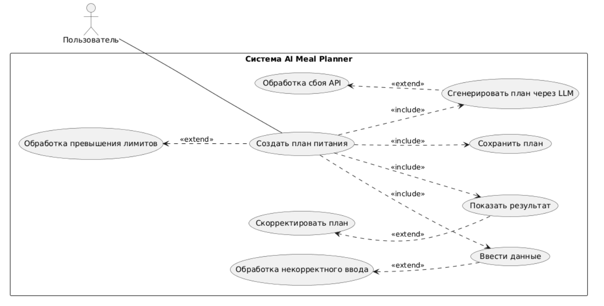

# D2: Use-case Narrative - AI Meal Planner

## Use-Case: Создание персонализированного недельного плана питания

- **Actor:** Пользователь (зарегистрированный и авторизованный)
- **Goal:** Получить недельный план питания, рецепты и список покупок, которые соответствуют его целям, бюджету и предпочтениям.

---

### 1. Happy Path (Основной успешный сценарий)

**Описание:** Пользователь успешно создает персонализированный план питания с первого раза.

**Шаги:**

1.  **Начало:** Пользователь нажимает кнопку "Создать новый план питания" на главной странице.
2.  **Ввод данных:** Система отображает форму. Пользователь заполняет ключевые поля:
    - **Цель:** Похудение
    - **Бюджет:** 5000 руб/неделя
    - **Предпочтения:** Курица, рыба, гречка, овощи
    - **Ограничения / Аллергии:** Нет арахиса
    - **Дневная норма калорий:** 1800 ккал
3.  **Генерация:** Пользователь нажимает "Сгенерировать план".
4.  **Обработка:** Фронтенд отправляет запрос на бэкенд. Бэкенд формирует промпт для LLM, отправляет его, получает и обрабатывает ответ.
5.  **Результат:** Система отображает сгенерированный план:
    - Меню на 7 дней (завтрак, обед, ужин).
    - Краткие рецепты для каждого блюда.
    - Итоговый список покупок на неделю.
    - Расчетная стоимость и КБЖУ на каждый день.
6.  **Завершение:** Пользователь доволен результатом и нажимает "Сохранить план в мой профиль".

**User Value:**

- **Экономия времени:** Пользователь получает готовый план за несколько минут, а не часов.
- **Персонализация:** План точно соответствует индивидуальным потребностям и бюджету.
- **Удобство:** Все в одном месте — меню, рецепты, список покупок.

---

### 2. Alternative Flows (Альтернативные сценарии)

#### Альтернативный сценарий 1: Корректировка плана

**Описание:** Сгенерированный план не полностью устраивает пользователя, и он запрашивает изменения.

**Шаги:**

1.  ... (Шаги 1-5 из Happy Path)
2.  **Оценка:** Пользователь видит в плане блюдо, которое ему не нравится (например, тушеная капуста).
3.  **Действие:** Пользователь нажимает кнопку "Заменить блюдо" или "Сгенерировать заново с другими блюдами".
4.  **Обработка:** Система отправляет повторный запрос к LLM с уточнением (например, "избегать тушеной капусты").
5.  **Новый результат:** Система отображает обновленный план питания. Пользователь сохраняет его.

**User Value:**

- **Гибкость:** Возможность быстро адаптировать план под свои вкусы без повторного заполнения всей формы.
- **Повышение удовлетворенности:** Пользователь получает результат, который ему действительно нравится.

#### Альтернативный сценарий 2: Неполный ввод данных

**Описание:** Пользователь заполняет только обязательные поля (например, цель и калории), оставляя бюджет и предпочтения пустыми.

**Шаги:**

1.  ... (Шаг 1 из Happy Path)
2.  **Ввод данных:** Пользователь заполняет только поля "Цель" и "Калории".
3.  **Генерация:** Нажимает "Сгенерировать план".
4.  **Обработка:** Система использует значения по умолчанию для пустых полей (например, средний бюджет, популярные продукты) и генерирует план.
5.  **Результат:** Отображается общий, менее персонализированный план. Система может показать подсказку: "Для более точного плана укажите бюджет и предпочтения".

**User Value:**

- **Низкий порог входа:** Позволяет получить результат даже с минимальным количеством информации.
- **Обучение:** Подсказки помогают пользователю понять, как улучшить результат в следующий раз.

---

### 3. Error Handling (Обработка ошибок)

#### Сценарий ошибки 1: Технический сбой (LLM API недоступен)

- **Триггер:** Пользователь нажимает "Сгенерировать план", но сервер не может получить ответ от внешнего LLM API.
- **Реакция системы:**
  - Отобразить на фронтенде сообщение: "Произошла ошибка при генерации плана. Пожалуйста, попробуйте позже."
  - Залогировать ошибку на бэкенде с кодом ответа от API.
  - Кнопка генерации становится снова активной через несколько секунд.
- **User Value:**

  - **Прозрачность.** Пользователь понимает, что проблема временная и не на его стороне, и может повторить попытку позже.

#### Сценарий ошибки 2: Некорректный ввод данных (Валидация на фронтенде)

- **Триггер:** Пользователь вводит текст в числовое поле "Бюджет" (например, "пять тысяч") или оставляет обязательное поле "Цель" пустым.
- **Реакция системы:**
  - Подсветить красным некорректно заполненное поле.
  - Показать текстовую подсказку под полем: "Пожалуйста, введите число" или "Это поле обязательно для заполнения".
  - Кнопка "Сгенерировать план" неактивна, пока ошибки не будут исправлены.
- **User Value:**

  - **Предотвращение ошибок.** Пользователь получает мгновенную обратную связь и исправляет ошибку до отправки запроса, экономя время.

#### Сценарий ошибки 3: Превышение лимитов использования (для Free-тарифа)

- **Триггер:** Пользователь с бесплатным тарифом пытается сгенерировать 4-й план за день (при лимите в 3).
- **Реакция системы:**
  - Запрос на бэкенд блокируется.
  - На фронтенде отображается модальное окно: "Вы достигли дневного лимита на создание планов. Чтобы снять ограничения, перейдите на Pro-тариф."
- **User Value:**

  - **Четкие правила.** Пользователь ясно понимает ограничения сервиса и видит путь для их снятия (апгрейд).

---

### 4. Use-case UML диаграмма

Ниже представлена диаграмма основного Use-Case.

---

### Definition of Done

- [x] Описан детальный Happy Path для основного use-case "Создание персонализированного недельного плана питания".
- [x] Определены 2 альтернативных сценария (Корректировка плана, Неполный ввод данных).
- [x] Описаны 3 сценария ошибок (Технический сбой, Некорректный ввод, Превышение лимитов).
- [x] Для каждого сценария указана конкретная ценность для пользователя.
- [x] Создана Use-case UML диаграмма в формате Mermaid.
- [x] Документ сохранен как `docs/use-cases.md`.
- [x] Проведен walkthrough всех сценариев с командой, получен ✅ от каждого участника.
