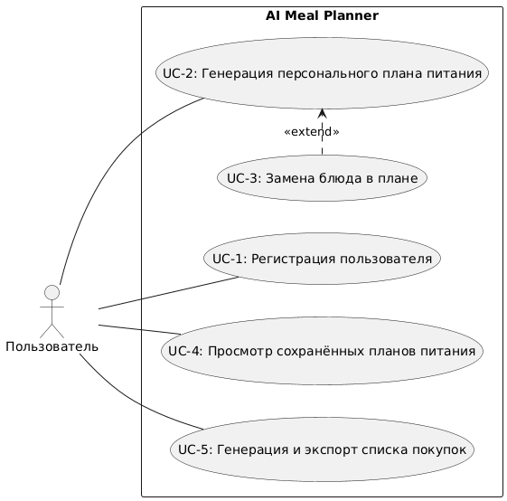
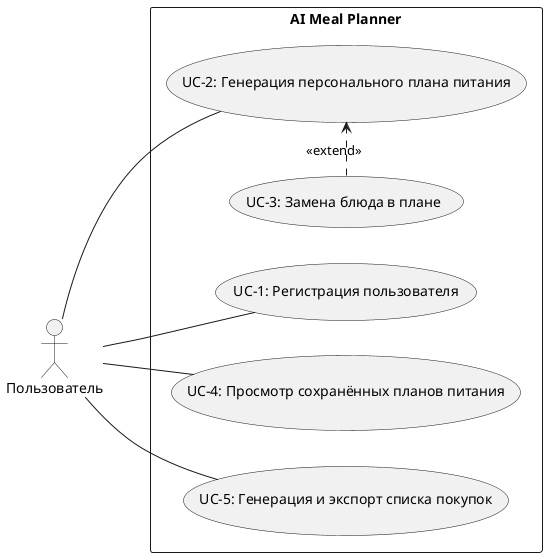

# D2: Use-case Narrative - AI Meal Planner

## Список Use-Cases

1. Регистрация пользователя
2. Генерация персонального плана питания
3. Замена блюда в плане
4. Просмотр сохранённых планов питания
5. Генерация и экспорт списка покупок

---

## Use-Case Diagram

```plantuml
@startuml
left to right direction
actor "Пользователь" as User

rectangle "AI Meal Planner" {
  usecase "UC-1: Регистрация пользователя" as UC1
  usecase "UC-2: Генерация персонального плана питания" as UC2
  usecase "UC-4: Просмотр сохранённых планов питания" as UC4
  usecase "UC-5: Генерация и экспорт списка покупок" as UC5

  usecase "UC-3: Замена блюда в плане" as UC3

  UC3 .> UC2 : <<extend>>
}

User -- UC1
User -- UC2
User -- UC4
User -- UC5

@enduml
```

---

## UC-1: Регистрация пользователя

### Описание

Пользователь создаёт или активирует учётную запись для доступа к системе.

### Actors

- **Primary:** Пользователь (незарегистрированный)

### Preconditions

- Пользователь не авторизован
- Система доступна

### Postconditions

- Создана учётная запись
- Пользователь авторизован и перенаправлен в личный кабинет

---

### Сценарии

| Тип                    | Название             | Описание                                                                                                                                                                  | User Value     |
| ---------------------- | -------------------- | ------------------------------------------------------------------------------------------------------------------------------------------------------------------------- | -------------- |
| **Happy Path**         | Успешная регистрация | 1. Пользователь нажимает "Войти" 2. Заполняет данные или выбирает способ авторизации 3. Система создаёт профиль и выполняет вход 4. Открывается главная страница | Быстрый вход   |
| **Alternative Flow 1** | Повторный вход       | **Ветвление с шага 3:** если профиль уже существует, система пропускает создание и сразу выполняет вход                                                                   | Удобство       |
| **Error Scenario 1**   | Ошибка соединения    | **Ветвление с шага 3:** при недоступности сервера отображается сообщение “Не удалось выполнить вход” и кнопка “Повторить”                                                 | Прозрачность   |
| **Error Scenario 2**   | Неверные данные      | **Ветвление с шага 2:** при ошибке в данных форма подсвечивает поле и сообщает о проблеме                                                                                 | Обратная связь |

---

## UC-2: Генерация персонального плана питания

### Описание

Пользователь создаёт персонализированный недельный план питания, указав свои параметры.

### Actors

- **Primary:** Пользователь (авторизованный)

### Preconditions

- Пользователь авторизован
- Форма генерации доступна

### Postconditions

- Создан и сохранён индивидуальный план питания

---

### Сценарии

| Тип                    | Название                 | Описание                                                                                                                                                                                                                        | User Value                    |
| ---------------------- | ------------------------ | ------------------------------------------------------------------------------------------------------------------------------------------------------------------------------------------------------------------------------- | ----------------------------- |
| **Happy Path**         | Успешная генерация плана | 1. Пользователь выбирает “Создать новый план” 2. Вводит параметры: цель, бюджет, калорийность, предпочтения 3. Нажимает “Сгенерировать” 4. Система обрабатывает данные 5. Отображает недельный план и сохраняет его | Персонализированный результат |
| **Alternative Flow 1** | Быстрые шаблоны          | **Ветвление с шага 2:** пользователь выбирает готовый шаблон — система пропускает ввод параметров и сразу формирует план                                                                                                        | Экономия времени              |
| **Alternative Flow 2** | Минимальные данные       | **Ветвление с шага 2:** пользователь вводит только обязательные поля — система создаёт базовый план и предлагает уточнить параметры                                                                                             | Простота                      |
| **Error Scenario 1**   | Ошибка генерации         | **Ветвление с шага 4:** если система не может создать план, показывается сообщение “Попробуйте позже” и кнопка “Повторить”                                                                                                      | Надёжность                    |
| **Error Scenario 2**   | Неверные данные формы    | **Ветвление с шага 2:** поля подсвечиваются, кнопка “Сгенерировать” блокируется                                                                                                                                                 | Предотвращение ошибок         |
| **Error Scenario 3**   | Превышен лимит генераций | **Ветвление с шага 3:** система сообщает о лимите (3/3 в день) и предлагает обновить тариф                                                                                                                                      | Прозрачность и монетизация    |

---

## UC-3: Замена блюда в плане

### Описание

Пользователь заменяет конкретное блюдо в уже сгенерированном плане.

### Actors

- **Primary:** Пользователь (авторизованный)

### Preconditions

- Существует сохранённый план питания
- План открыт

### Postconditions

- Блюдо заменено, показатели КБЖУ пересчитаны

---

### Сценарии

| Тип                    | Название               | Описание                                                                                                                                                                                        | User Value        |
| ---------------------- | ---------------------- | ----------------------------------------------------------------------------------------------------------------------------------------------------------------------------------------------- | ----------------- |
| **Happy Path**         | Замена блюда           | 1. Пользователь открывает план 2. Нажимает на блюдо 3. Выбирает “Заменить” 4. Система предлагает альтернативы 5. Пользователь выбирает вариант 6. План обновляется и сохраняется | Гибкость          |
| **Alternative Flow 1** | Замена вручную         | **Ветвление с шага 3:** пользователь выбирает блюдо из своей базы, система проверяет совместимость и сохраняет                                                                                  | Контроль          |
| **Error Scenario 1**   | Нет подходящей замены  | **Ветвление с шага 4:** система сообщает, что не удалось подобрать вариант, и предлагает ручной выбор                                                                                           | Альтернатива      |
| **Error Scenario 2**   | Замена нарушает баланс | **Ветвление с шага 5:** появляется предупреждение “План станет выше на 400 ккал. Продолжить?”                                                                                                   | Информированность |

---

## UC-4: Просмотр сохранённых планов питания

### Описание

Пользователь просматривает все свои планы и открывает нужный.

### Actors

- **Primary:** Пользователь (авторизованный)

### Preconditions

- Есть хотя бы один сохранённый план

### Postconditions

- Пользователь видит список и детали выбранного плана

---

### Сценарии

| Тип                    | Название               | Описание                                                                                                     | User Value       |
| ---------------------- | ---------------------- | ------------------------------------------------------------------------------------------------------------ | ---------------- |
| **Happy Path**         | Просмотр списка планов | 1. Пользователь выбирает “Мои планы” 2. Система загружает список 3. Пользователь открывает нужный план | Организованность |
| **Alternative Flow 1** | Пустой список          | **Ветвление с шага 2:** если планов нет — показывается сообщение “Создайте первый план” и кнопка “Создать”   | Мотивация начать |
| **Alternative Flow 2** | Фильтрация планов      | **Ветвление с шага 2:** пользователь применяет фильтры, система обновляет список                             | Удобство         |
| **Error Scenario**     | Ошибка загрузки        | **Ветвление с шага 2:** при сбое соединения система сообщает “Не удалось загрузить” и предлагает “Обновить”  | Прозрачность     |

---

## UC-5: Генерация и экспорт списка покупок

### Описание

Пользователь создаёт список покупок на основе выбранного плана и экспортирует его.

### Actors

- **Primary:** Пользователь (авторизованный)

### Preconditions

- Есть активный план питания с рецептами

### Postconditions

- Список покупок создан и экспортирован

---

### Сценарии

| Тип                    | Название                   | Описание                                                                                                                                                                                | User Value      |
| ---------------------- | -------------------------- | --------------------------------------------------------------------------------------------------------------------------------------------------------------------------------------- | --------------- |
| **Happy Path**         | Экспорт в PDF              | 1. Пользователь открывает план 2. Нажимает “Список покупок” 3. Система формирует список по ингредиентам 4. Пользователь нажимает “Экспортировать в PDF” 5. Файл сохраняется | Удобство        |
| **Alternative Flow 1** | Редактирование списка      | **Ветвление с шага 3:** пользователь снимает галочки с лишних продуктов, система пересчитывает итог                                                                                     | Гибкость        |
| **Alternative Flow 2** | Копирование текста         | **Ветвление с шага 4:** пользователь выбирает “Копировать текст” — список копируется в буфер                                                                                            | Мобильность     |
| **Error Scenario 1**   | Нет данных об ингредиентах | **Ветвление с шага 3:** система сообщает, что данные устарели, и предлагает обновить план                                                                                               | Предсказуемость |
| **Error Scenario 2**   | Ошибка экспорта            | **Ветвление с шага 4:** если экспорт не удался, появляется сообщение и альтернативные кнопки (копировать/повторить)                                                                     | Надёжность      |

---

## Definition of Done

- [x] Happy Path для каждого use-case
- [x] Альтернативные и ошибочные сценарии с указанием шагов
- [x] Все действия выполняет только актор «Пользователь»
- [x] Диаграмма без технических систем
- [x] Все сценарии описывают видимое поведение, а не реализацию
